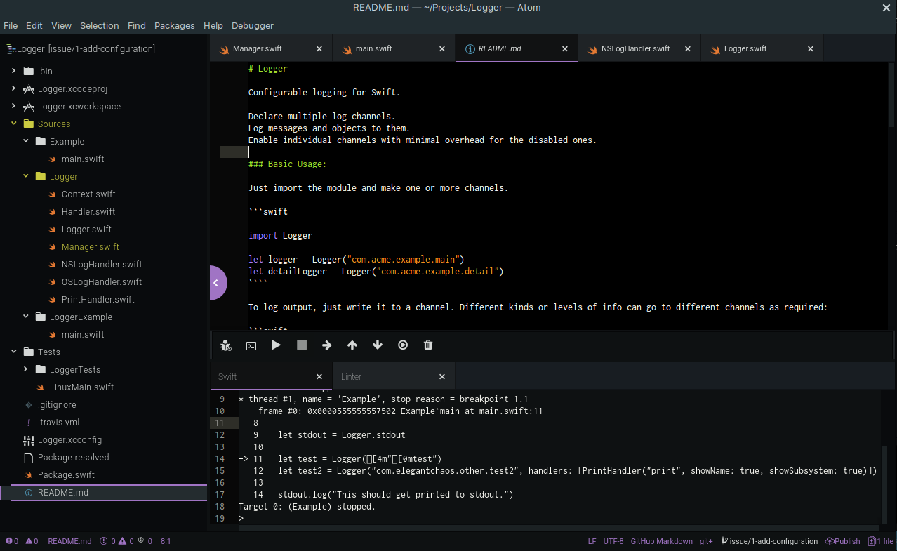

# Swift IDE

This is the beginnings of an Atom IDE implementation for Swift.

It's very rough at the moment, and doesn't actually use much of the atom-ide-ui capabilities.



### Supported Platforms

This package is being actively developed on Linux.

At this early stage of development it's only been tested on Ubuntu 18.04, using a custom build of swift/lldb. In theory it should work on other platforms if you have swift/lldb installed.

Please let me know by filing issues.

### Package Dependencies

You need the following Atom packages:

- language-swiftt89
- tool-bar
- atom-swift-ui

You can install these with:

```
apm install language-swift-89 atom-ide-ui tool-bar
```

### Usage

Make sure that the package dependencies are installed and enabled.

Go to the preferences for this package and enter paths for the `swift` and `lldb` executables. In theory they should get picked up from your path if you leave these settings blank, but at this early stage of the package's development, it's safer to enter them explicitly.

Open a Swift project - it needs to be one that builds with `swift build`.

Set some breakpoints in your source code, using the Atom IDE breakpoints UI.

Choose `Swift IDE` / `Debug` from the package menu.

Enter the name of the product you want to run in the debugger, by doing `e=NameOfYourProduct`

Hit the Run button.


*The plan is obviously to integrate fully into the Atom IDE user interface, but note that currently*:

- the run/step/pause etc functionality is using our own tool bar
- the only part of the Atom IDE UI that works are the breakpoints
- all interaction with lldb is via commands, typed into the Swift panel


### Credits

Original code by Sam Deane, Elegant Chaos.

Thanks to:

- the Swift and Atom teams, for so much awesome
- [@aciidbomb3r] for [swift-debugger](https://github.com/aciidb0mb3r/atom-swift-debugger), which got the ball rolling
