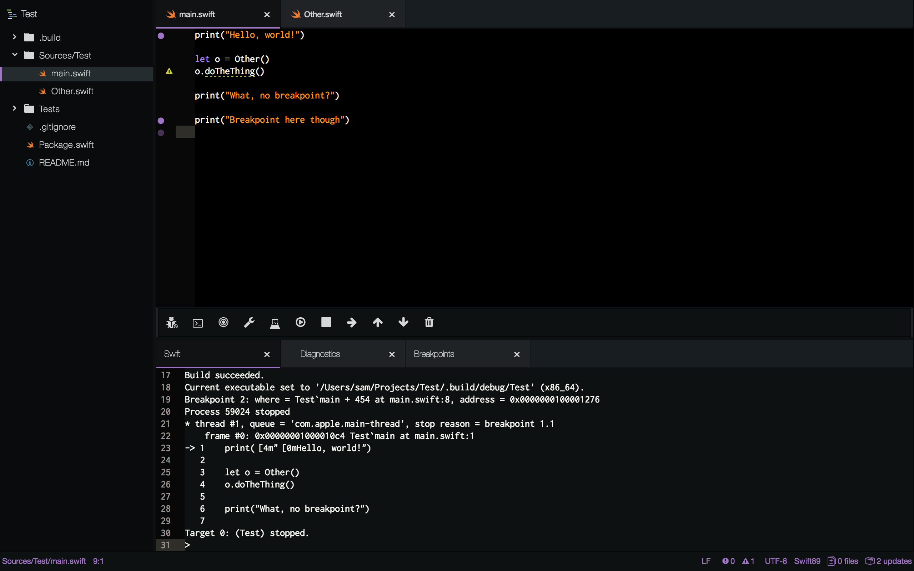
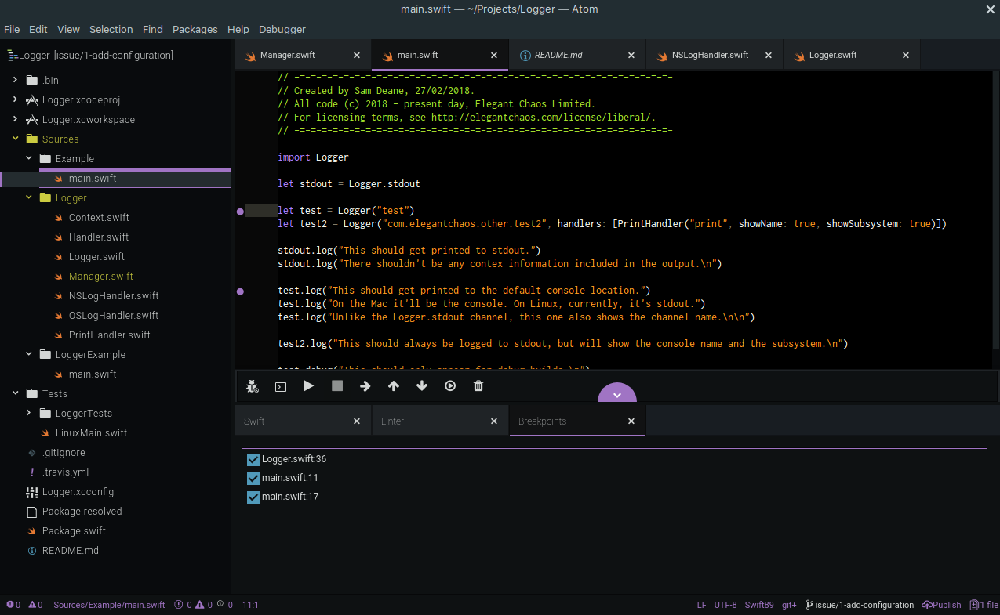
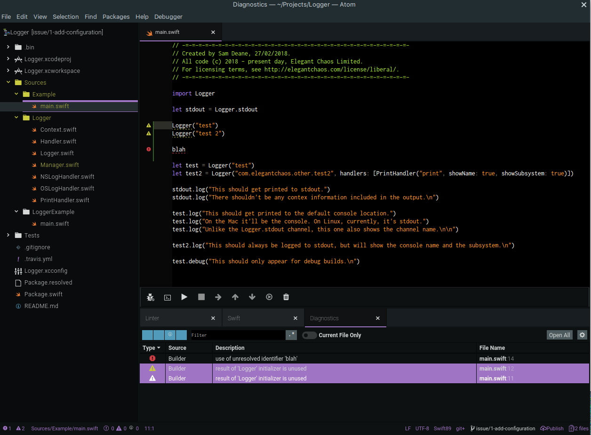
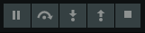

# Swift IDE

This is the rough beginnings of an Atom IDE implementation for Swift.

What it allows you to do right now is:

- auto-completion of Swift code (using sourcekitten)
- build via (`swift build`)
- view a list of build warnings and errors
- set breakpoints in your swift code
- launch your built application within lldb
- pause at breakpoints
- interact with lldb using its command-line interface



At this stage the package has many rough edges. That said, please do [file suggestions, comments and bug reports](https://github.com/elegantchaos/atom-ide-swift/issues).


## Background

This started life as a package which managed its own breakpoints and launched and interacted with lldb on its own, and a separate package which provided Swift auto-completion.

In the meantime, the [Atom IDE](https://ide.atom.io/) project has come along, providing some standardised capabilities and user interfaces for better integration of language features into Atom.

The long-term goal for this package is to migrate into adopting those capabilities.

However, at the moment the integration is restricted to setting/viewing breakpoints, and viewing build warnings and errors. The actual building and debugging process is handled with custom code.


### Supported Platforms

A large part of the motivation for this project is that I'm using Linux a lot at the moment, and so don't have access to Xcode.

As a result, this package is being actively developed on Linux (currently Ubuntu 18.04).

At this early stage of development it's only been tested on Ubuntu 18.04, and macOS 10.12.

On Ubuntu I'm using an unmodified version of swift/lldb that I built locally, roughly equivalent to Swift 4.2.

In theory the package should work fine on any platforms that has swift/lldb installed. If it doesn't, [please let me know](https://github.com/elegantchaos/atom-ide-swift/issues).


### Caveat Emptor!

*The plan is obviously to integrate fully into the Atom IDE user interface, but note that currently*:

- the run/step/pause etc functionality is using our own tool bar (at the bottom of the screen in the screenshot)
- you may need to toggle the toolbar visible (`Toolbar: Toggle`)
- the only part of the Atom IDE UI that works are the breakpoints
- all interaction with lldb is via commands, typed into the Swift panel
- the first two buttons on the toolbar in the screenshot belong to atom-ide and not us!


### Package Dependencies

You need the following Atom packages:

- language-swift-89
- tool-bar
- atom-swift-ui

You can install these with:

```
apm install language-swift-89 atom-ide-ui tool-bar
```

## Usage

Make sure that the package dependencies are installed and enabled.

Go to the preferences for this package and enter paths for the `swift` and `lldb` executables. In theory they should get picked up from your path if you leave these settings blank, but at this early stage of the package's development, it's safer to enter them explicitly.

Open a Swift project that builds with `swift build`.

Set some breakpoints in your source code, using the Atom IDE breakpoints UI.

Choose `IDE Swift: Debug` from the command palette.


### Breakpoints

You can add breakpoints by clicking to the left of the gutter in any source file.

Open the command palette and select `Debugger: Show Window Breakpoints` to show a list of all breakpoints, and can manually move/dock this tab to bring it closer to the Swift/lldb repl.




### Diagnostics

If the build produces warnings or errors, they should show up in the diagnostics panel.



To get this panel to show, open the command palette and select `Diagnostics: Toggle Table`.


### Toolbar

The toolbar we're using is the one provided by the `tool-bar` package.


Note that there is also a toolbar, with debugger-ish looking buttons, provided by the Atom ID user interface.



Obviously that's the one we should be using, and integrating properly with it is high on the list of priorities.

For now though, don't let it fool you!

Just to add to the confusion, the Atom IDE user interface adds a couple of buttons to the toolbar that we _are_ using.

In the screenshot above, the first two buttons are actually the Atom IDE ones, and nothing to do with us!


### Builder Support

The Swift Package Manager (which we use as our build system), is a capable package manager, but quite basic as a build system. In particular, it currently doesn't support running scripts or other tools as part of the build, or have a way to specify configuration settings in bulk and apply them uniformly.

To address this, I have an experimental build system layered on top of the Swift Package Manager, which is imaginatively titled [Builder](https://github.com/elegantchaos/builder).

If the project you are attempting to build/test/debug is using Builder, then the IDE will attempt to use it instead of the Swift Package Manager.

If you're not using Builder, you shouldn't notice any difference.


## Credits

The bulk of the code is by Sam Deane, Elegant Chaos.

Thanks to:

- the Swift and Atom teams, for so much awesome.
- [@aciidb0mb3r](https://github.com/aciidb0mb3r/) for [swift-debugger](https://github.com/aciidb0mb3r/atom-swift-debugger), which got the ball rolling.
- [@kelvin13](https://github.com/kelvin13) for [language-swift89](https://github.com/kelvin13/atom-swift-89/blob/master/settings/language-swift.cson).
- [@jpsim](https://github.com/jpsim) for [sourcekitten](https://github.com/jpsim/SourceKitten).
